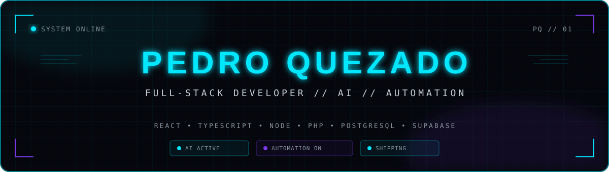

<!-- ============================================================
     PEDRO QUEZADO // GITHUB PROFILE
     ============================================================ -->

<div align="center">



<br/>

<a href="https://readme-typing-svg.demolab.com">
  
</a>

<br/><br/>

<a href="https://pedroquezado.com.br">
  
</a>
&nbsp;
<a href="mailto:eu@pedroquezado.com.br">
  
</a>
&nbsp;
<a href="https://github.com/pedroquezado">
  
</a>

</div>

<br/>

<!-- ============================================================
     SYSTEM / WHOAMI
     ============================================================ -->

## `> system.whoami()`

```typescript
const pedro = {
  name: "Pedro Quezado",
  role: "Full-Stack Developer",

  focus: [
    "Artificial Intelligence",
    "AI Agents",
    "Business Automation",
    "SaaS",
    "CRM & ERP",
    "API Integrations",
    "Production Systems",
  ],

  stack: {
    frontend: ["React", "TypeScript", "JavaScript"],
    backend: ["Node.js", "PHP"],
    database: ["PostgreSQL", "Supabase"],
    infrastructure: ["GitHub", "Docker", "Cloudflare", "Linux"],
    ai: ["OpenAI", "AI Agents", "LLM Integrations"],
  },

  status: "BUILDING",
  environment: "PRODUCTION",
};
```

<div align="center">

```text
╭─────────────────────────────────────────────────────────────────╮
│                                                                 │
│  SYSTEM STATUS      ● ONLINE                                    │
│  DEVELOPMENT        ● ACTIVE                                    │
│  AI SYSTEMS         ● RUNNING                                   │
│  AUTOMATION         ● ENABLED                                   │
│  PRODUCTION         ● SHIPPING                                  │
│                                                                 │
╰─────────────────────────────────────────────────────────────────╯
```

</div>

<br/>

<!-- ============================================================
     TECH MATRIX
     ============================================================ -->

## `> technology.matrix`

<div align="center">

### Core Development


<br/><br/>

### Data & Infrastructure


<br/><br/>

### Development Environment


</div>

<br/>

<!-- ============================================================
     ENGINEERING
     ============================================================ -->

## `> engineering.focus`

<table>
<tr>
<td width="50%" valign="top">

### `01 // AI SYSTEMS`

AI agents, LLM integrations and intelligent automation designed to operate inside real business workflows.

```text
AI AGENTS
LLM INTEGRATION
TOOL USE
AUTOMATION
RAG
PROMPT ENGINEERING
```

</td>

<td width="50%" valign="top">

### `02 // FULL-STACK`

End-to-end software architecture, from frontend applications to APIs, databases and production infrastructure.

```text
REACT
TYPESCRIPT
NODE.JS
PHP
POSTGRESQL
SUPABASE
```

</td>
</tr>

<tr>
<td width="50%" valign="top">

### `03 // AUTOMATION`

Systems that integrate platforms, APIs, CRMs, ERPs and operational workflows.

```text
REST APIs
WEBHOOKS
BROWSER EXTENSIONS
CRM
ERP
WHATSAPP
WORKFLOWS
```

</td>

<td width="50%" valign="top">

### `04 // PRODUCTION`

Engineering focused on reliability, observability, security, auditability and real-world operation.

```text
CI/CD
GITHUB ACTIONS
DATABASE
RLS
LOGGING
AUDIT
FAIL-SOFT
```

</td>
</tr>
</table>

<br/>

<!-- ============================================================
     PROJECTS
     ============================================================ -->

## `> active.systems`

<table>
<tr>
<td width="50%" valign="top">

### `⚡ WhatsApp CRM Hub`

CRM and communication architecture integrating WhatsApp, business workflows, automation and artificial intelligence.

**Stack**

`React` `TypeScript` `Supabase` `PostgreSQL` `AI`

**Status**

`PRIVATE` • `PRODUCTION`

</td>

<td width="50%" valign="top">

### `⚡ Vendasuplementos`

Business ecosystem covering sales, inventory, logistics, financial operations and internal workflows.

**Stack**

`React` `TypeScript` `PostgreSQL` `Supabase`

**Status**

`PRIVATE` • `PRODUCTION`

</td>
</tr>

<tr>
<td width="50%" valign="top">

### `⚡ GHL WhatsApp Bridge`

Integration and automation layer connecting WhatsApp workflows, CRM operations and intelligent agents.

**Stack**

`JavaScript` `APIs` `GHL` `AI` `Automation`

**Status**

`PRIVATE` • `ACTIVE`

</td>

<td width="50%" valign="top">

### `⚡ VHSYS Automation`

Browser extensions and automation systems for commercial and operational processes.

**Stack**

`TypeScript` `Browser Extensions` `APIs` `Automation`

**Status**

`PRIVATE` • `ACTIVE`

</td>
</tr>
</table>

<br/>

<!-- ============================================================
     OPEN SOURCE
     ============================================================ -->

## `> open.source`

<div align="center">

<a href="https://github.com/pedroquezado/router">
  
</a>

<a href="https://github.com/pedroquezado/api-loader">
  
</a>

<a href="https://github.com/pedroquezado/correios">
  
</a>

<a href="https://github.com/pedroquezado/braspress">
  
</a>

</div>

<br/>

<!-- ============================================================
     TELEMETRY
     ============================================================ -->

## `> github.telemetry`

<div align="center">





</div>

<br/>

<div align="center">


</div>

<br/>

<!-- ============================================================
     CONTRIBUTION SNAKE
     ============================================================ -->

## `> contribution.engine`

<div align="center">

<picture>
  <source
    media="(prefers-color-scheme: dark)"
    srcset="https://raw.githubusercontent.com/pedroquezado/pedroquezado/output/github-contribution-grid-snake-dark.svg"
  />
  <source
    media="(prefers-color-scheme: light)"
    srcset="https://raw.githubusercontent.com/pedroquezado/pedroquezado/output/github-contribution-grid-snake.svg"
  />
  
</picture>

</div>

<br/>

<!-- ============================================================
     FOOTER
     ============================================================ -->

<div align="center">

```text
┌────────────────────────────────────────────────────────────────┐
│                                                                │
│    CODE  //  AUTOMATION  //  INTELLIGENCE  //  PRODUCTION     │
│                                                                │
└────────────────────────────────────────────────────────────────┘
```

<br/>


<br/><br/>

<sub>
Pedro Quezado // Full-Stack Developer
</sub>

<br/>

<sub>
BUILD • AUTOMATE • MEASURE • IMPROVE • SHIP
</sub>

</div>
